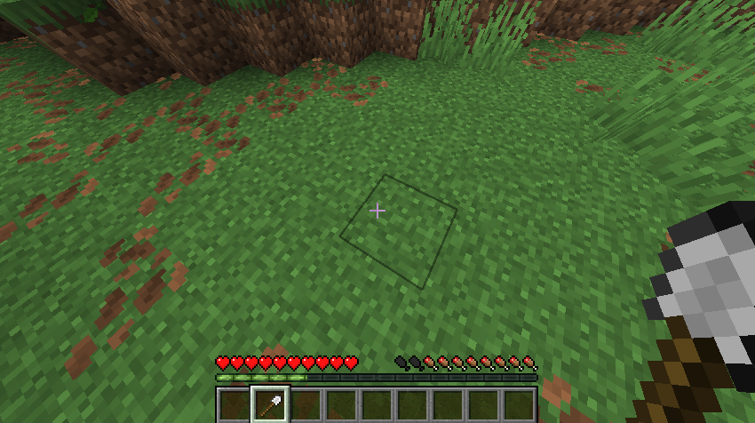

# Path Undo

A server-side Fabric mod that allows you to turn a path block back into a grass block.

Simple, easy and survival friendly. No need to break blocks, just use a shovel.
When you use a shovel on a path block, it will turn it back into a grass block. It will also damage the shovel.

 

  

 

## License

[LGPL-3.0](LICENSE)
